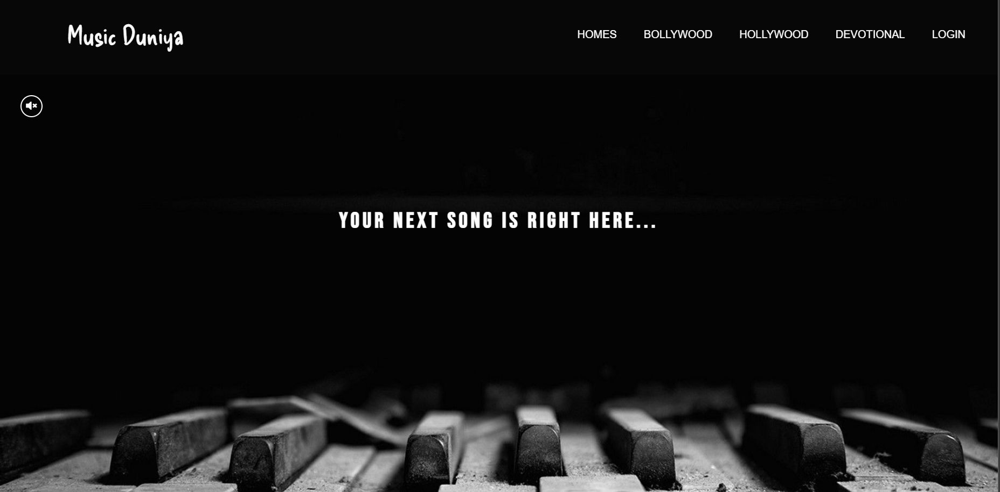
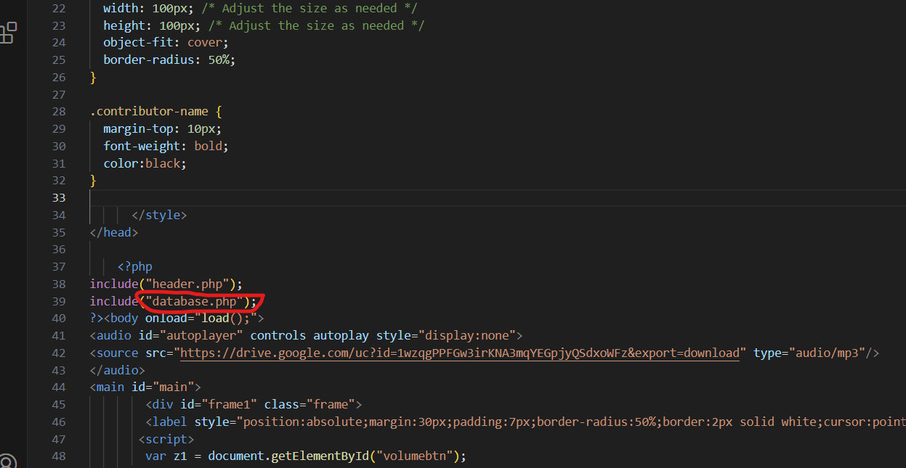

# Website-MusicDuniya

### <a href="http://code4xu.xyz/">Click Here for Preview </a>

### This is a Music Website Based on Html,Css,Js and Php. For DataBase I have used MySQL. 

 
 The website is not compatible with small devices like tablet and smartphones.
 
 ## Description
 
 Every single data item is retrived from the database in the website.  
 All the post links are redirect to the single page page.php with different data. 
 we also add a admin panel to add new post 
 User have to login first before playing the music. 
 
#### If anyone want to Use
if any want to use this project, he/she can easily use it. if you want to use it in local server simple start your xampp server and put all these file in htdocs folder. now change the database connection file. "database.php" to "db_connect.php".

do this with all files except header.php, footer.php,database.php and css files

for adding database create a database with the name as you want. now add that name in the db_connect.php file. 
and import my *.sql file in the database. 

For any query feel free to contact at code4xu.contact@gmail.com
